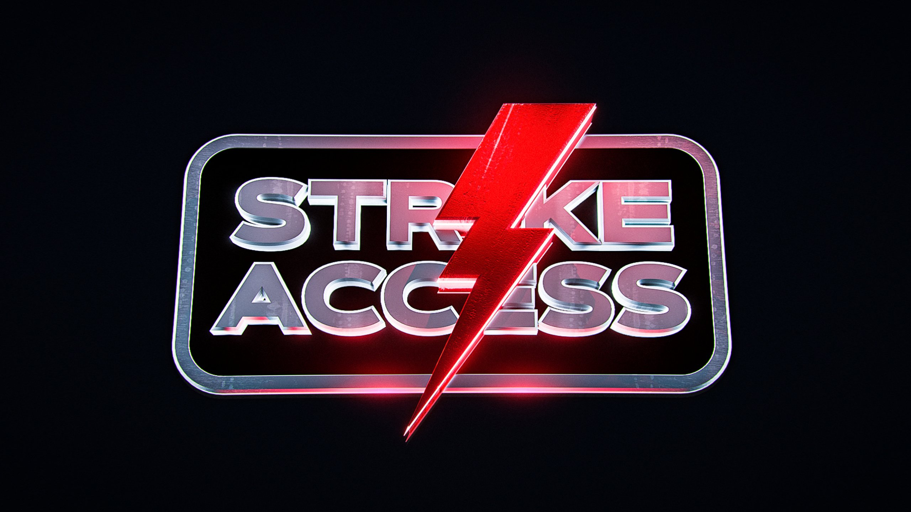

---

isDraft: false
isBigHeadline: false
isSmallHeadline: false
title: "Auto Checkout (ACO): The Future of Fast, Efficient Shopping"
description: "Learn how Auto Checkout (ACO) automates online purchases, increasing speed and efficiency for securing limited-edition products, popular items, and more."
keywords: "Auto Checkout, ACO, bots, sneaker bots, online shopping, automation"
cover: "./imgs/ACOs2.png"
category: bots
publishedTime: "2025-02-26T00:00:00.000Z"
authors: ["ahmed-khan"]
---

## **Introduction**  
In the fast-paced world of online shopping, every second counts—especially when securing limited-edition items, exclusive drops, or high-demand products. Auto Checkout (ACO) technology has revolutionized how users purchase items online, automating the checkout process to save time and improve purchase success rates.  

Whether you’re a sneakerhead trying to cop the latest release, a reseller looking for an edge, or just someone who wants a hassle-free checkout experience, ACO can be a game-changer. In this article, we’ll break down what ACO is, how it works, its benefits, and potential risks.  

---

## **What Is Auto Checkout (ACO)?**  
Auto Checkout (ACO) is a feature or software tool that automatically fills in customer details—such as shipping address, payment information, and billing details—allowing users to complete purchases instantly. ACO is commonly integrated into **browser extensions, bots, and automated scripts** to bypass manual input, reducing the time it takes to secure a purchase.  

This technology is widely used in high-demand shopping scenarios, such as:  
- **Sneaker Drops** (Nike SNKRS, Adidas Confirmed, Yeezy Supply)  
- **Popular Releases**  
- **Limited-Edition Product Launches** (Gaming consoles, collectibles, tech gadgets)  
- **Flash Sales & Clearance Events**  

---

## **How Does ACO Work?**  
Auto Checkout tools work by automating key steps in the purchase process:  

### **1. Product Selection**  
Users preconfigure the tool with specific product details, including size, color, quantity, and preferred retailer.  

### **2. Autofill Personal & Payment Information**  
The ACO tool automatically enters personal details like name, address, phone number, and payment credentials, eliminating the need for manual entry.  

### **3. Instant Purchase Execution**  
When a product becomes available, the tool swiftly completes the transaction, bypassing slow page loads or checkout bottlenecks.  

### **4. Order Confirmation & Monitoring**  
Some ACO tools also provide real-time monitoring to notify users about purchase status, failed attempts, or restock alerts.  

---

## **Types of Auto Checkout Tools**  

There are different types of ACO tools available, each catering to different users:  

### **1. Browser Extensions**  
- Simple autofill tools for Google Chrome or Mozilla Firefox  
- Often used for casual online shoppers  

### **2. Bot-Assisted ACO**  
- Advanced automation for high-demand product drops  
- Includes sneaker bots, retail bots, and custom scripts  

### **3. Custom Scripts & API-Based Checkout**  
- Used by advanced users with coding knowledge  
- Integrates with e-commerce APIs for direct purchases  
- Common in **reselling communities and e-commerce automation**  

---

## **Benefits of Auto Checkout (ACO)**  

✔ **Speed & Efficiency** – Reduces checkout time to milliseconds, increasing the chances of securing limited-stock items.  

✔ **Convenience** – No need to manually enter shipping or payment details every time.  

✔ **Higher Success Rates** – For hyped product releases, ACO improves chances of successful checkouts.  

✔ **Reduces Cart Abandonment** – Instant processing prevents losing items due to checkout delays.  

---

## **Risks & Ethical Concerns**  

⚠ **Bans & Account Flagging** – Retailers implement anti-bot measures; using ACO tools excessively can lead to bans.  

⚠ **Security Risks** – Storing payment details in third-party ACO tools could expose users to hacking or fraud.  

---

## **Best Practices for Safe ACO Use**  

🔹 Use trusted ACO tools to minimize fraud risks.  

🔹 If unsure, use a virtual credit card to keep you safe.

---

## **Final Thoughts**  

Auto Checkout (ACO) is transforming the way people shop online, making purchases faster and more efficient. Whether you're a casual shopper looking for a smoother experience or a reseller aiming for high success rates, ACO can be a powerful tool. However, it’s essential to use it responsibly to avoid bans, security risks, or ethical concerns.  

Looking for a group that does ACOs in the US?
<a href="https://whop.com/checkout/plan_kSGsfEzIV6QO0/?a=resellgroup&d2c=true" target="_blank" rel="noopener noreferrer">
  ## Try out Strike Access
</a>

They provide an ACO dashboard that is simple and easy to use. 
Check it out in their **Slots** section!

 
 

