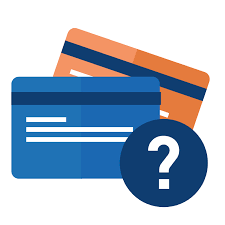
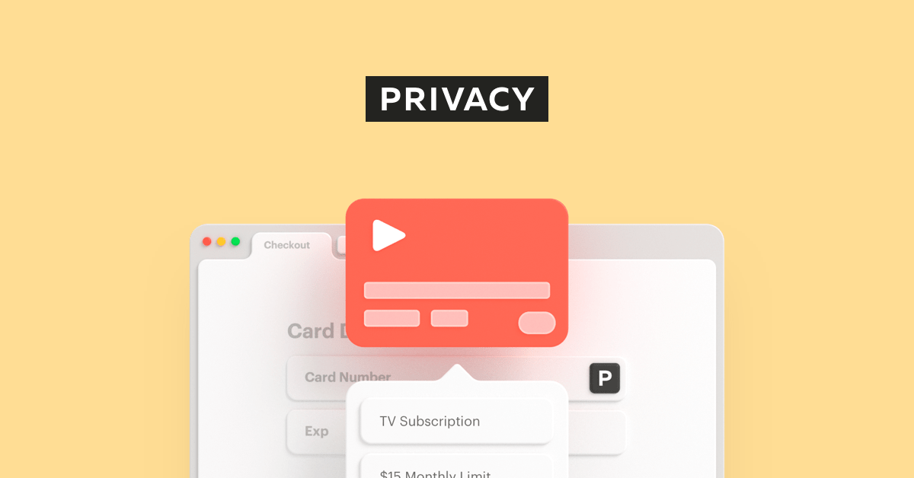

## **Introduction**
In today’s digital age, we understand that in the fast-paced world of reselling and online entrepreneurship, safeguarding your financial transactions is paramount. Virtual Credit Cards (VCCs) have emerged as essential tools for hustlers aiming to protect their assets while streamlining operations. This article delves into what VCCs are, their benefits, and how they can be integrated into your reselling toolkit.

---

## **What Is a VCC?**

A Virtual Credit Card (VCC) is a digital payment card that functions similarly to a traditional credit card, but without the physical plastic. You typically receive a unique card number, expiration date, and security code, which can be used for online transactions.

**Key Features:**
- **Enhanced Security:** Each VCC is disposable, minimizing the risk of fraud.
- **Spending Limits:** Set specific limits to prevent unauthorized charges.
- **Anonymity:** Keep your real card details confidential during transactions.

---

## **Why VCCs Are Essential**

### 1. Secure Transactions
When dealing with unfamiliar vendors or new platforms, the risk of fraud is significant. VCCs act as a protective barrier, ensuring your primary financial information remains secure.

### 2. Budget Management
People often juggle multiple purchases simultaneously. VCCs allow you to allocate specific budgets for each transaction or vendor, aiding in meticulous financial tracking and preventing overspending.

### 3. Simplified Subscription Handling
Managing various subscriptions for tools, cook groups, or monitoring services is common in reselling. Assigning a unique VCC to each subscription simplifies tracking and cancellation processes.

---

## **Where Can I Get VCCs?**

### 1. Services
Services like [Privacy.com](https://app.privacy.com/join/9SU4D) offer an easy way to create virtual credit cards. By signing up through this link, you'll receive a $5 bonus upon successful account creation and linking a funding source.

### 1. Banks & Credit Unions
Major banks are increasingly offering VCC services to existing customers. Log in to your bank’s online portal or mobile app to see if virtual card creation is available.

### 3. Credit Card Issuers
Some leading credit card issuers (e.g., Capital One, Citi) have “virtual account numbers” tied to your physical card.

## Like to get $5 with [Privacy.com](https://app.privacy.com/join/9SU4D)?

<a href="https://app.privacy.com/join/9SU4D" target="_blank" rel="noopener noreferrer">
  ## Click this link to recive $5 on privacy
</a>
---

## **Conclusion**
Virtual credit cards have become a go-to solution for consumers looking to enhance online security, prevent scams, and maintain greater control over their finances. By generating unique payment details for each purchase or subscription, you can reduce fraud risks and improve your budgeting process.

With a VCC in your wallet (virtual, of course), you’ll shop with peace of mind—knowing you’re better protected against identity theft and able to maintain tighter control over your spending.

 
 
