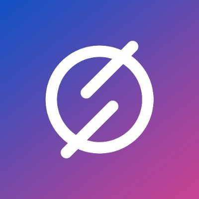

---

isDraft: false
isBigHeadline: false
isSmallHeadline: true
title: "Best Bots in 2025: Which One is Right for You?"
description: "Discover the top reselling bots of 2025, including Stellar AIO and Refract, to maximize profits and secure high-demand products faster than ever."
keywords: "best reselling bots 2025, AIO bots, Walmart bot, Amazon bot, Shopify bot, Target bot, Stellar AIO, Refract bot, Bot Mart, Tidal Marketplace"
cover: "./imgs/botCover.jpg"
category: bots
publishedTime: "2025-01-26T00:00:00.000Z"
authors: ["ahmed-khan"]
---

# Bots

A bot in the reselling world is an automated software program designed to secure high-demand items faster than a human could manually. These bots track product drops, instantly fill in payment and shipping details, and complete checkouts within seconds. Many can run multiple tasks simultaneously, increasing the chances of success. Some bots, known as All-in-One (AIO) bots, support multiple retailers like Walmart, Amazon, Target, and Shopify, while others focus on specific platforms, such as ticket or sneaker reselling. While bots give resellers a significant edge in acquiring limited-edition products like sneakers, gaming consoles, graphics cards, and collectibles, there are still many different things like proxies, servers, and bot settings. Bots are a powerful tool for resellers looking to maximize profits in competitive markets.

## Stellar AIO

Stellar AIO is a top-tier, beginner-friendly bot that also delivers high-level performance for experienced resellers. For $99/month, it supports Walmart, Amazon, Target, Best Buy, Shopify, and 100+ more sites across the US, Canada, Japan, UK, EU, and more regions coming soon. With an industry-leading UI and powerful automation, Stellar AIO makes reselling easy while maximizing profitability. Whether you're just starting or a seasoned pro, this bot is built to help you dominate the market!

<a href="https://whop.com/stellaraio/?a=resellgroup" target="_blank" rel="noopener noreferrer">
    ### [Click here to to look at stellaraio]
</a>

## Refract

Refract is a high-performance reselling tool with a $150 initial fee and a $50/month renewal, offering global support for Amazon, Walmart, Best Buy US, Target, and Apple. Members gain access to a custom deal finder, advanced checkout modules, and the ability to run UNLIMITED tasks, ensuring maximum efficiency and profit potential. With 24/7 customer support, Refract provides a seamless experience for resellers looking to scale their operations and stay ahead in the market.

<a href="https://refractbot.com/?via=gnarly" target="_blank" rel="noopener noreferrer">
    ### [Click here to join Refract]
</a>

## Other bots

Tidal Marketplace and Bot Mart are two of the most well-known Discord-based marketplaces for buying, selling, and trading reselling bots, cook group memberships, and digital tools. These platforms serve as trusted hubs for resellers looking to secure automation software, proxies, or community access while ensuring safe transactions through verified middlemen services.

Tidal Marketplace is highly regarded for its strict verification process and secure transactions, making it a go-to for purchasing reselling bots, retail and sneaker monitors, and proxies. It provides a structured marketplace where resellers can safely trade high-demand digital products.

Similarly, Bot Mart offers a large buyer and seller network specializing in bot reselling, rentals, and related services. Users can find listings for bot licenses, proxies, and automation tools, with a ticket-based system for dispute resolution to enhance buyer protection. Many transactions in both marketplaces utilize verified middlemen, ensuring both parties receive their product or payment securely.

Both Tidal and Bot Mart are essential platforms for resellers, providing access to high-demand bots and digital tools while minimizing the risk of scams. Whether you're looking to buy, sell, or trade in the reselling space, these marketplaces offer a safe and structured environment to maximize your success.

 
 

