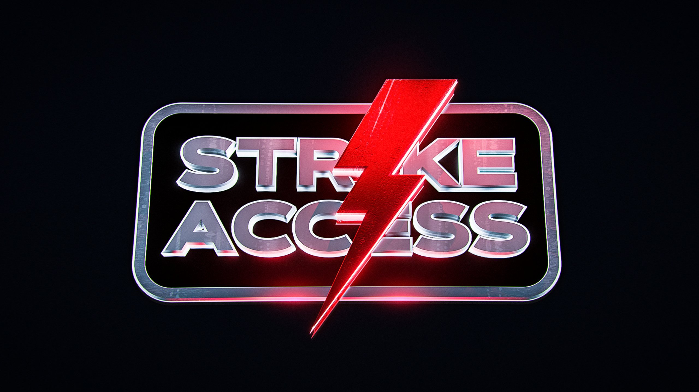

---

isDraft: false
isBigHeadline: true
isSmallHeadline: false
title: "Best US Cook Groups in 2025 - Top Reselling Communities"
description: "Looking for the best cook groups in 2025? Join exclusive Discord reselling communities for sneakers, Pokémon, GPUs & more. Maximize your profits today!"
keywords: "Cook group, Best cook groups 2025, Reselling cook groups, Sneaker cook group, GPU cook group, Pokémon reselling group, Exclusive resell groups "
cover: "./imgs/cook-groups-image.avif"
category: reselling
publishedTime: "2025-01-06T00:00:00.000Z"
authors: ["ahmed-khan"]
---

# What is a cook group?

A cook group is an online community that provides valuable tools, tips, and resources to help members secure high-demand items like Pokémon packs, GPUs, sneakers, and collectibles. These groups, typically hosted on Discord, offer insider knowledge, restock alerts, and automation tools to improve your chances of copping limited-edition products. The most effective ones usually require a monthly subscription. Whether you're a collector or reseller, joining a cook group can be an essential tool for staying ahead and securing the most sought-after items.

Looking for UK or EU cook groups? Check out these articles.  
[Top EU Cook Groups](https://hustlehare.com/articles/article-cookgroupEU) 
[Top UK Cook Groups](https://hustlehare.com/articles/article-cookgroupUK)

 
# Top 3 US Cook Groups 

## Strike Access Full Access

Strike is one of the oldest and most established Cook Groups, going strong since its start in 2018 With 1,500 members and a $50/month membership fee, it offers a range of valuable resources, including free ACOs, collectible insights, tons of monitors, real-time alerts, free food and Discord tools, in-depth guides, botting 1-on-1 help, Pokémon/GPU/Lego leads, and much more. Members can also access ticket flips and expert advice to maximize profits.

The owner, Tiana, with over ten years of buying and selling experience, has helped individuals in the community generate over $5 million in revenue. Whether you’re a beginner looking to start a business from home or a collector aiming to build the ultimate collection, Strike provides the tools and guidance to succeed.

<a href="https://whop.com/checkout/plan_kSGsfEzIV6QO0/?a=resellgroup&d2c=true" target="_blank" rel="noopener noreferrer">
  ## Click here to join Strike Access
</a>

 

## Divine Premium Access

Divine has been a Cook Group since 2021, dedicated to helping its 3,000 members succeed. For $69.99/month, members gain access to daily leads, special software, price error alerts, investment channels, and expert support. The group also offers eBay and FBA classes, free Automated Checkout Services (ACOs), and on-staff accountants for financial advice. With over 50 specialists covering online money-making opportunities, Divine provides valuable tools and insights. If you can justify the fee, it’s a strong investment for serious online entrepreneurs.

<a href="https://whop.com/full-membership-fa/?a=resellgroup" target="_blank" rel="noopener noreferrer">
### [Click here to join Devine Premium Access]
</a>

 

## GFNF Full Membership

  

GFNF offers top-tier opportunities for Vinyl flips, concert and event tickets, sports cards, Pokémon cards, Legos, sneakers, comics, video games, and more. With a $17.50/week membership, members gain access to expert insights and profitable reselling leads. GFNF also provides a 1-on-1 onboarding call to help new members get started. If you're looking to maximize your reselling game, this group is worth checking out!

<a href="https://whop.com/full-membership-fa/?a=resellgroup" target="_blank" rel="noopener noreferrer">
  ### [Click here to join GFNF Full Membership]
</a>
 

