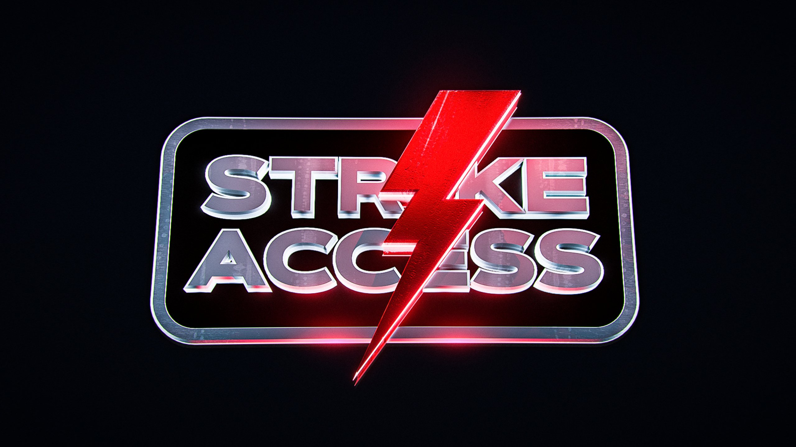

---

isDraft: false
isBigHeadline: false
isSmallHeadline: false
title: "Looking for a Cook Group in 2025?"
description: "An in-depth look at closures in JavaScript and their applications."
keywords: "yo, too"
cover: "./imgs/Top-UK-Cook-Groups.png"
category: reselling
publishedTime: "2025-02-06T00:00:00.000Z"
authors: ["ahmed-khan"]
---

# What is a cook group?

A cook group is an online community that provides valuable tools, tips, and resources to help members secure high-demand items like Pokémon packs, GPUs, sneakers, and collectibles. These groups, typically hosted on Discord, offer insider knowledge, restock alerts, and automation tools to improve your chances of copping limited-edition products. The most effective ones usually require a monthly subscription. Whether you're a collector or reseller, joining a cook group can be an essential tool for staying ahead and securing the most sought-after items.

## Top 3 US Cook Groups 

Resellers Paradise Premium

Resellers Paradise is the ultimate resource for resellers, offering expert tools, insights, and support to help you succeed. For £24/month, members gain access to a fast Vinted monitor and autobuyer, providing an efficient way to source profitable stock, including Pokémon cards, GPUs, sneakers, and more. The group also includes comprehensive guides, 1-on-1 support for beginners, and 24/7 expert assistance for all business needs. Additionally, members receive exclusive access to a bespoke Vinted monitor and autobuyer along with a 40-page, 10,000-word outlet reselling guide. Whether you're flipping collectibles, electronics, or fashion, Resellers Paradise equips you with everything needed to thrive in today’s marketplace.

Takara

Takara helps beginners and seasoned resellers break into eBay and ticket reselling for £30/month, maximizing profits with worldwide ticket releases, 0% eBay fees, and daily profitable pings. Members gain 24/7 support, expert guides, and insights from a team with 50 years of experience. From price errors and freebies like Timex watches and Oodies to high-demand products, Takara ensures you never miss an opportunity. If there’s money to be made, they’re on it!

Astro Alerts

Astro Alerts is a UK and EU Cook Group designed to help individuals succeed in reselling, offering comprehensive guides, personalized consultations, and expert insights into profitable deals. For £30/month, members gain access to exclusive low-key flips, weekly group buys, and real-time Nike stock numbers. The group provides 24/7 support from experienced reselling professionals and offers free access to the Astro Raffles bot, unlocking exciting raffle opportunities. Astro Alerts is ready to equip you with the tools and knowledge needed to thrive in the market.

